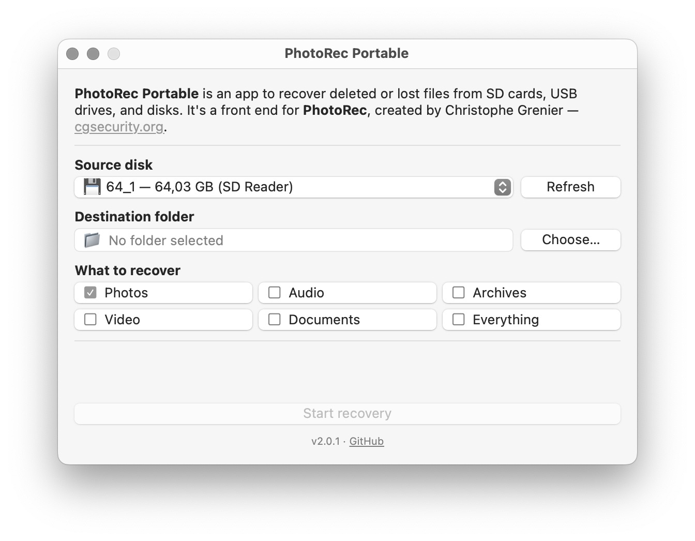
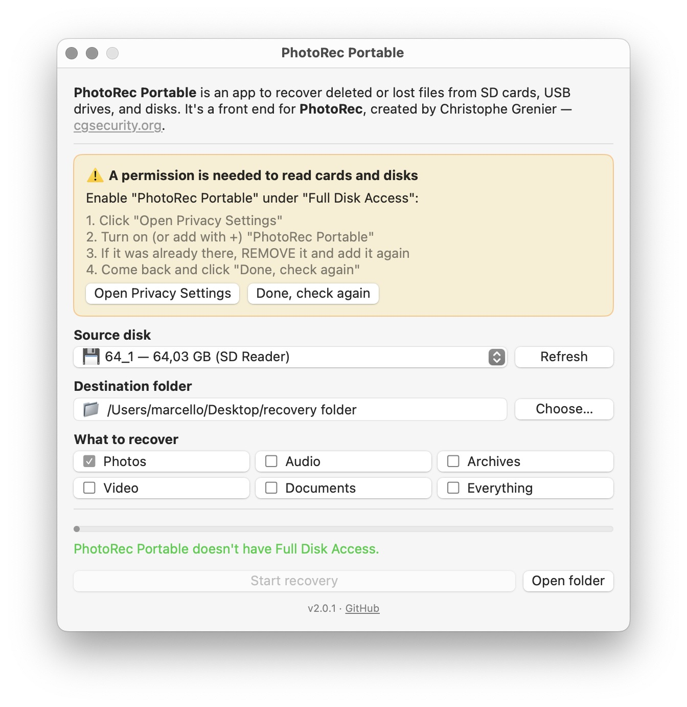
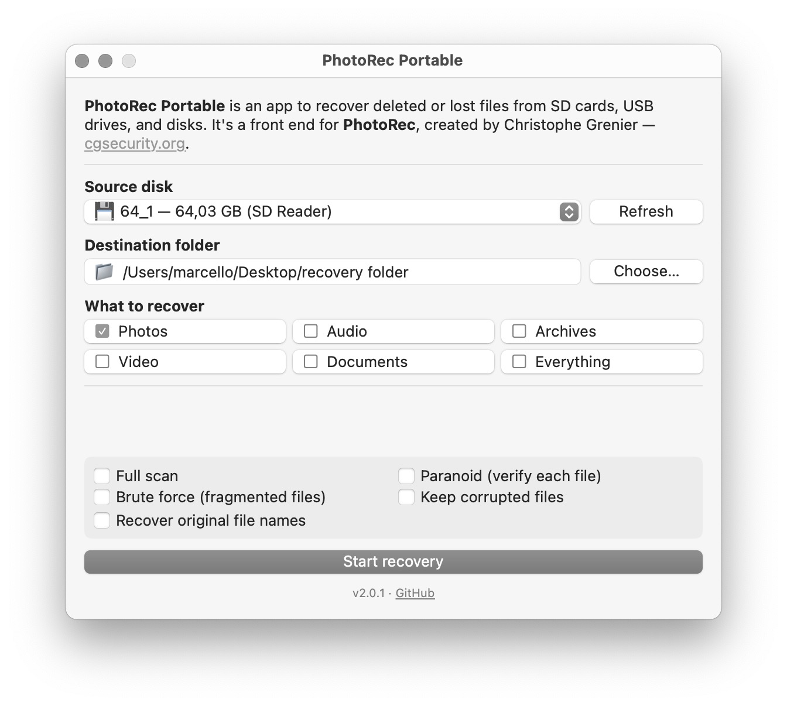

# PhotoRec Portable

A simple, self-contained macOS app to recover deleted or lost files from SD cards, USB drives, and disks.

PhotoRec Portable is a friendly graphical front end for **PhotoRec**, the powerful file-recovery engine created by Christophe Grenier. PhotoRec is extremely capable but runs in a text-only terminal interface that's intimidating for most people. This app wraps it in a clean macOS window: pick a disk, pick where to save, choose what to recover, and press a button.

It's **portable**: everything it needs is inside the app. No Homebrew, no Terminal, no extra downloads.

  

---

## Download and install

1. Go to the [**Releases**](https://github.com/marcelloemme/PhotoRec-Portable/releases) page and download the latest `PhotoRec-Portable-x.y.z.zip`.
2. Unzip it (double-click). You get a **PhotoRec Portable** folder containing `PhotoRec Portable.app` and a helper called **`Apri PhotoRec Portable.command`**. Keep them together. Move the folder to `Applications` if you like.
3. **First launch:** because the app isn't signed with a paid Apple Developer certificate, macOS blocks it the first time. Pick whichever works for you:
   - **Easiest (works on macOS Sequoia and Tahoe):** double-click **`Apri PhotoRec Portable.command`** in the folder. It removes the download quarantine from the app and opens it. The first time, Terminal asks you to confirm you want to run it — click **Open**. You only need this once.
   - **Or manually:** **right-click** (Control-click) the app → **Open** → **Open** again. On some macOS versions you instead go to **System Settings → Privacy & Security**, scroll down, and click **Open Anyway**. *(On macOS Tahoe / 26 this manual route sometimes fails with "can't be opened" — in that case use the `.command` helper above.)*
4. **Grant Full Disk Access.** macOS protects access to disks and cards. The app shows a yellow banner with step-by-step instructions the first time — you enable *PhotoRec Portable* under **System Settings → Privacy & Security → Full Disk Access**. This is required to read your disks.

  

**Requirements:** macOS 13 (Ventura) or newer, including macOS 26 (Tahoe). Works on both Apple Silicon (M1/M2/M3/…) and Intel Macs. On Apple Silicon the bundled recovery engine runs through Rosetta 2, which macOS installs automatically if needed.

---

## How to use

The window walks you through three steps, top to bottom.

### 1. Source disk

Pick the disk or card you want to recover from. Removable drives (SD cards, USB sticks) are marked with 💾 and listed first; internal drives are marked with 🖥️. Press **Refresh** if you plug something in after opening the app.

During recovery the app temporarily unmounts this disk so it can read it directly, then remounts it automatically when finished. The disk briefly disappears from Finder — that's normal and expected.

### 2. Destination folder

Choose where to save the recovered files. **Always pick a disk different from the one you're recovering from** — saving onto the same disk can overwrite the very files you're trying to get back. The app warns you and blocks the start button if you pick a folder on the source disk. It also checks there's enough free space before starting.

### 3. What to recover

Tick the categories you want:

| Category | Includes |
| --- | --- |
| **Photos** | JPEG, PNG, GIF, TIFF, and camera RAW formats (Fujifilm, Canon, Olympus, Panasonic, Sigma, and more) |
| **Audio** | MP3, FLAC, OGG, and others |
| **Archives** | ZIP, RAR, 7z, TAR, and others |
| **Video** | MP4/MOV, MKV, MPEG, AVCHD, and others |
| **Documents** | PDF, Office documents, RTF, plain text |
| **Everything** | All supported types (slower) |

Then press **Start recovery**. You'll be asked for your administrator password (needed to read the raw disk). A progress bar shows the percentage, the number of files found so far, and an estimated time remaining. You can press **Cancel** at any time — the files found up to that point are kept.

### The result

When recovery finishes, the app organizes everything neatly in your destination folder: recovered files are **sorted into subfolders by type** (`jpg/`, `raf/`, `pdf/`, and so on). Files that were only partially recoverable are placed in a separate `corrupted/` subfolder. Press **Open folder** to see the results.

**Original photo dates are restored automatically.** For photos and RAW files, the app reads the *date taken* from the EXIF metadata inside each file and sets it as the file's creation and modification date. So even though the files were just recovered, Finder shows the real date the photo was taken, and everything sorts chronologically as expected. Files without EXIF data are left untouched.

By default, recovery only scans the **free space** of the disk — that is, the area where deleted files live. This is much faster than scanning the whole disk and is the right choice for the most common case ("I accidentally deleted my photos"). If nothing is found there, the app automatically falls back to a full scan.

---

## Advanced mode

For difficult cases, enable **Options → Advanced mode** (⇧⌘A). Extra options appear:

  

- **Recover original file names** — PhotoRec recovers the *contents* of files but names them generically (`f0000100.jpg`). With this option on, the app reads the original file names straight from the card's filesystem and matches each recovered file back to its real name — so your photos come out as `DSCF1234.RAF` again instead of `f0000100.raf`. It works on exFAT cards (the standard format for SD/SDXC cards); on other filesystems the recovery still works, just with generic names. This adds an extra read pass over the card, which is why it's optional.
- **Full scan** — scans the entire disk instead of just the free space. Use this when the card was reformatted, or when the quick scan didn't find your files. It's slower but more thorough.
- **Paranoid** — verifies every recovered file, reducing false positives.
- **Brute force** — attempts to recover more heavily fragmented files. Slow, and not always reliable, but can rescue files a normal scan misses.
- **Keep corrupted files** — keeps files that couldn't be fully recovered instead of discarding them. They're placed in the `corrupted/` subfolders. Useful when a partial file is better than nothing.

Leave Advanced mode off for everyday recovery — the defaults are tuned for it. (Original photo dates are restored in both modes; only the name recovery above is advanced-only.)

---

## Updates

PhotoRec Portable checks for new versions on launch. When one is available, a banner appears; click **Update** and the app downloads the new version, replaces itself in place, and restarts. After an update you'll need to re-open it once (right-click → Open) and re-grant Full Disk Access, because the new build has a different signature — a limitation of unsigned apps.

---

## How it works, and credits

PhotoRec Portable is a graphical wrapper. The actual recovery is done by **PhotoRec 7.2** (February 2024), whose command-line binary is bundled inside the app. When you press *Start recovery*, the app:

1. unmounts the source disk so the raw device can be read,
2. runs PhotoRec in batch mode with the options you selected,
3. reads PhotoRec's progress from its output to drive the progress bar,
4. optionally reads the filesystem to recover the original file names (see Advanced mode),
5. remounts the disk, reorganizes the recovered files by type, and restores photo dates from EXIF.

The graphical interface is written in SwiftUI and built with `swiftc` (no Xcode required). PhotoRec ignores the filesystem and searches the underlying data directly, which is why it can recover files even from a formatted or damaged card — and why recovered files come out with generic names (`f0000100.jpg`) by default. To bring the real names back, the app separately reads the card's directory entries (read-only) and matches each recovered file to its original name by comparing the file contents — so nothing is ever written to the card during recovery.

### Credits and license

- **PhotoRec / TestDisk** — written and maintained by **Christophe Grenier** — <https://www.cgsecurity.org>
- PhotoRec logo by Marcel Bruins (2006); TestDisk logos by Simone Brandt and Dmitri Zdorov (2001).
- PhotoRec and TestDisk are released under the **GNU General Public License, version 2** (see [`COPYING`](COPYING)).

Because this project includes and builds on GPL-licensed software, PhotoRec Portable is likewise distributed under the **GNU GPL v2**. This app is an independent front end and is **not** affiliated with or endorsed by CGSecurity or Christophe Grenier.
